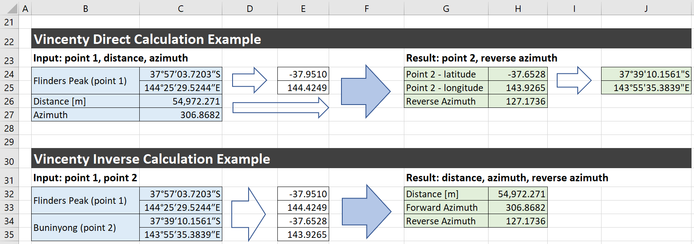

# Vincenty's Direct and Inverse Solution of Geodesics on the Ellipsoid - Excel VBA implementation
**to calculate new coordinate based on azimuth and distance (direct)  
or distance and azimuth based on two coordinates (inverse)**
> **Algorithms by Thaddeus Vincenty (1975)**  
> Based on the implementation in Java Script by Chris Veness  
> https://www.movable-type.co.uk/scripts/latlong-vincenty.html  
> https://github.com/chrisveness/geodesy

To make the long story short, I was looking for a way to calculate coordinates, distance and azimuth in Excel.
I checked out several available solutions but they were either incomplete, did not work or results were inaccurate.
That is how I ended up developing my own, complete Vincenty's Direct and Inverse formulae implementation.

## Excel files
+ [Vincenty.xlsm](../../raw/master/Vincenty.xlsm) - Excel Macro-Enabled Workbook (demo)
+ [Vincenty.xlam](../../raw/master/Vincenty.xlam) - Excel Add-in
+ [Vincenty.xls](../../raw/master/Vincenty.xls) - Excel 97-2003 Workbook (demo)
+ [Vincenty.xla](../../raw/master/Vincenty.xla) - Excel 97-2003 Add-in

> + There is no IntelliSense available for VBA UDFs. However, functions and their parameters are listed in Excel function wizard under the **Geodesic** or **User Defined** category.
> + Excel Add-in must be placed in a directory registered as "Trusted Location". See [Add, remove, or change a trusted location](https://support.office.com/en-us/article/add-remove-or-change-a-trusted-location-7ee1cdc2-483e-4cbb-bcb3-4e7c67147fb4) for more details. Demo workbook does not require Add-in.

## Implementation
Solution contains 6 functions implementing **Vincenty's Direct** and **Vincenty's Inverse** formulae as well as 2 functions for Decimal&nbsp;↔&nbsp;Degrees/Minutes/Seconds format conversion, and uses **WGS84** model.

+ `VincentyDirLat(lat As Double, lon As Double, azimuth As Double, distance As Double) As Variant`
Calculates geodesic latitude (in degrees) based on one point, bearing (in degrees) and distance (in m) using Vincenty's direct formula for ellipsoids.
+ `VincentyDirLon(lat As Double, lon As Double, azimuth As Double, distance As Double) As Variant`
Calculates geodesic longitude (in degrees) based on one point, bearing (in degrees) and distance (in m) using Vincenty's direct formula for ellipsoids.
+ `VincentyDirRevAzimuth(lat As Double, lon As Double, azimuth As Double, distance As Double) As Variant`
Calculates geodesic reverse azimuth (in degrees) based on one point, bearing (in degrees) and distance (in m) using Vincenty's direct formula for ellipsoids.
+ `VincentyInvDistance(lat1 As Double, lon1 As Double, lat2 As Double, lon2 As Double) As Variant`
Calculates geodesic distance (in m) between two points specified by latitude/longitude (in numeric degrees) using Vincenty's inverse formula for ellipsoids.
+ `VincentyInvFwdAzimuth(lat1 As Double, lon1 As Double, lat2 As Double, lon2 As Double) As Variant`
Calculates geodesic azimuth (in degrees) between two points specified by latitude/longitude (in numeric degrees) using Vincenty's inverse formula for ellipsoids.
+ `VincentyInvRevAzimuth(lat1 As Double, lon1 As Double, lat2 As Double, lon2 As Double) As Variant`
Calculates geodesic reverse azimuth (in degrees) between two points specified by latitude/longitude (in numeric degrees) using Vincenty's inverse formula for ellipsoids.
+ `ConvertDegrees(decimalDeg As Double, optional isLongitude as Variant) As String`
Converts decimal latitude, longitude or azimuth value to degrees/minutes/seconds string format. If isLongitude value is privided output will be formatted as either longitude (true) or latitude (false).
+ `ConvertDecimal(degreeDeg As String) As Variant`
Converts latitude, longitude or azimuth string in degrees/minutes/seconds format to decimal value. This function has been designed to handle typical formats.

## Source code
Excel workbooks contain unprotected source code. In addition, for better change tracking source code has been placed separately in [Vincenty.bas](Vincenty.bas) file. This file is all what is required to add implemented functions to any other Excel workbook.

## Validation
Calculation results have been validated using 1200 test cases generated for 6 range clusters and distance between 10 m and 30,000 km 
against **Geoscience Australia** website:
+ http://www.ga.gov.au/geodesy/datums/vincenty_direct.jsp
+ http://www.ga.gov.au/geodesy/datums/vincenty_inverse.jsp  

and **GeodSolve Library** by Charles Karney:
+ https://geographiclib.sourceforge.io/cgi-bin/GeodSolve
+ https://geographiclib.sourceforge.io/scripts/geod-google.html
+ https://link.springer.com/article/10.1007%2Fs00190-012-0578-z  

## Validation results - maximum deviation

&nbsp;|Geoscience Australia|GeodSolve Library
-----|-----:|-----:
VincentyDirLat()|0.0000005%|0.0000000%
VincentyDirLon()|0.0000002%|0.0000001%
VincentyDirRevAzimuth()|0.0000833%|0.0000000%
VincentyInvDistance()|0.0024183%|0.0001269%
VincentyInvFwdAzimuth()|0.0008098%|0.0003928%
VincentyInvRevAzimuth()|0.0005245%|0.0003928%

For complete test results refer to [VincentyTest.xlsm](../../raw/master/VincentyTest.xlsm) file.

## References

+ [Wikipedia: Vincenty's formulae](https://en.wikipedia.org/wiki/Vincenty%27s_formulae)
+ [Thaddeus Vincenty: original publication (1)](https://www.ngs.noaa.gov/PUBS_LIB/inverse.pdf)
+ [Thaddeus Vincenty: original publication (2)](https://geographiclib.sourceforge.io/geodesic-papers/vincenty75b.pdf)
+ [Wikipedia: Geodesics on an ellipsoid](https://en.wikipedia.org/wiki/Geodesics_on_an_ellipsoid)
+ [Wikipedia: Great-circle distance](https://en.wikipedia.org/wiki/Great-circle_distance)
+ [Wikipedia: Haversine formula](https://en.wikipedia.org/wiki/Haversine_formula)

## Feedback

Do not hesitate to rate this repo and/or leave comments/suggestions if you find my work useful.
